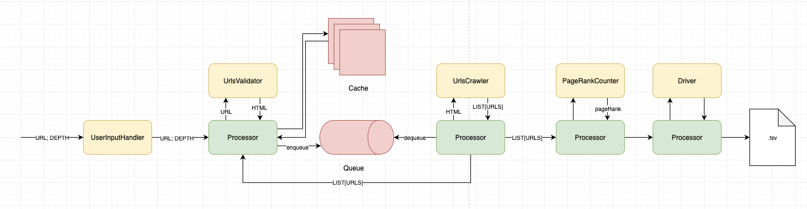

# Web Crawler
The system stands for recursive interface for `calculating page rank for a particular page (presneted by URL)`.

## System Design



## System Modules
-- Helpers
```
- `logger` - stands for internal logger interface.
- `models` - stands for main data model for the system.
- `driver` - stands for writing crawled pages into local machine.
```

-- Data Structures to Store Data Flow 
```
- `cache` - stands for caching crawled pages.
- `queue` - stands for enqueuing and dequeuing urls suppiosed to be process.
```

-- Modules to process Data Flow
```
- `users_input_handler` - stands for consuming and passing to the system user's input. 

- `urls_validator` - stands for validating particular url. 
- `linked_pages_crawler` - stands for fetching statically 

- `page_rank_counter` - stands for counting page rank.linked pages.
```

-- Tests
```
- `tests` - stands for system tests.
```

## Tests Usage
```bash
python -m unittest
```

### Features
- The crawler supports HTTP and HTTPS protocols
- The crawler recursive depth is 100

### Constraints
- A URL should be processed only if it points to an HTML document (AKA web page), otherwise the URL should be skipped
- The crawler should avoid, as reasonably as possible, re-downloading pages that were
already downloaded during the current execution

### Considerations
- Links in an HTML page can point to an absolute or a relative URL and both types should be handled. Links that point to an anchor in the same page should be
handled too.

### Potential Hands-on Improvments
- Introduce asynchronous pipe
- Add on mindful loggs (interface for logging already in place)
- Increase tests coverage